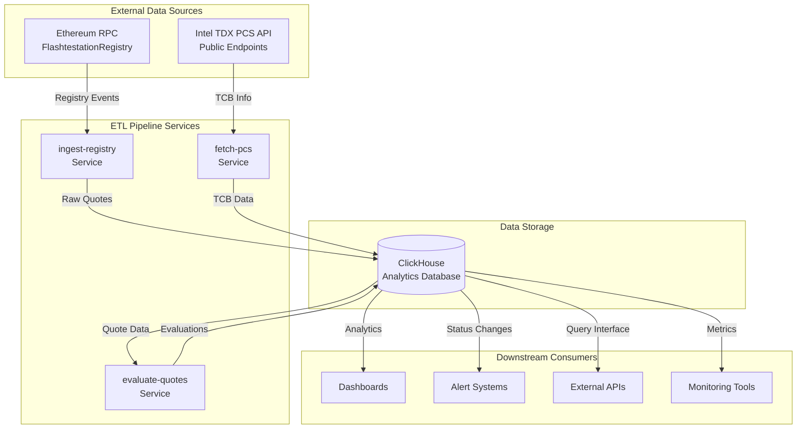
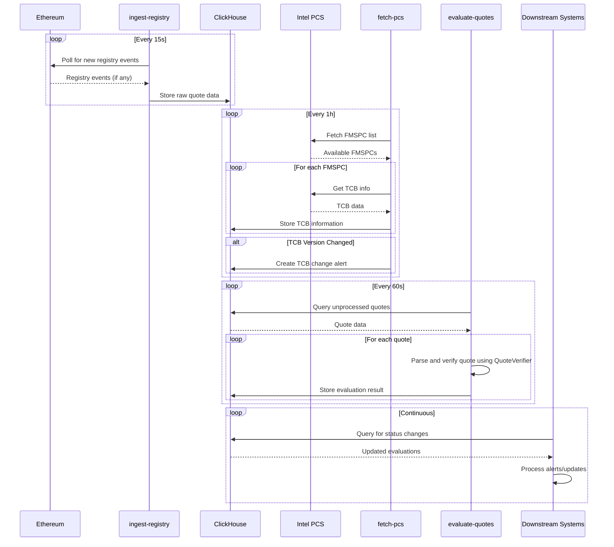
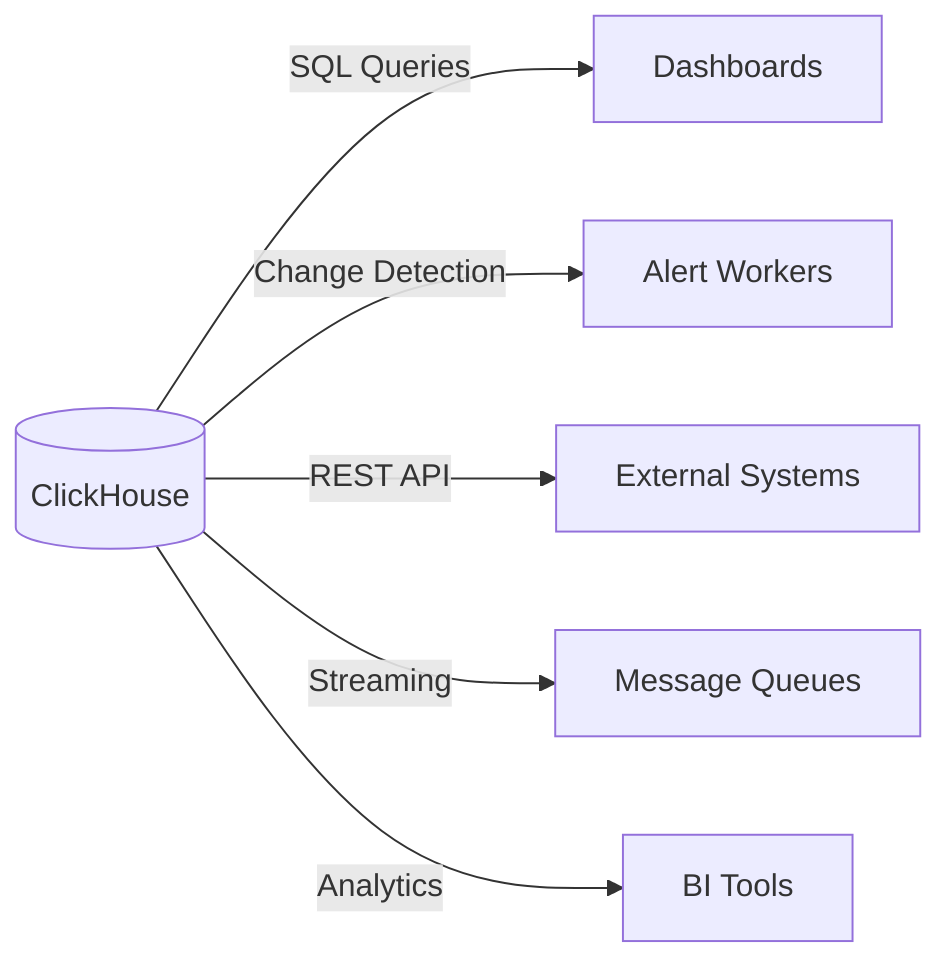

## **Summary**

The go-tcb-notify service is a critical component of the Flashtestation protocol that monitors Intel TDX (Trust Domain Extensions) TCB updates and evaluates TDX attestation quotes for validity. This service operates as an ETL (Extract, Transform, Load) pipeline that ingests data from multiple sources, processes it through separate services, and stores results in ClickHouse for downstream consumption by dashboards, alert systems, and other monitoring tools.

## **Problem Statement**

Intel periodically updates TCB requirements for TDX as they discover vulnerabilities or release security patches. When these updates occur:

- Previously valid TDX attestations may become outdated
- The Flashtestation registry needs to identify affected TDX attestations
- Affected TDX VMs must re-attest with updated requirements
- External systems need to be notified of status changes

The ETL pipeline approach provides a scalable, storage-centric solution that decouples data ingestion from alerting and enables multiple downstream consumers.

## **High-Level Architecture**



## **Core Components**

### **1. ingest-registry Service**

**Purpose**: Extract TDX attestation data from Ethereum blockchain

**Responsibilities**:

- Monitor FlashtestationRegistry smart contract events
- Extract `TEEServiceRegistered` and `TEEServiceInvalidated` events
- Parse and store raw quote data with blockchain metadata
- Maintain processing state for service restarts

**Key Implementation Details**:

- Polls Ethereum RPC every 15 seconds (configurable)
- Processes blocks in batches of 128 (configurable)
- Stores complete quote data with provenance information
- Tracks last processed block for resumption

### **2. fetch-pcs Service**

**Purpose**: Extract Intel TDX TCB information from Intel PCS API

**Responsibilities**:

- Fetch FMSPC list from Intel PCS
- Retrieve TCB information for each FMSPC
- Store complete TCB data with version tracking
- Generate alerts when TCB evaluation data numbers change

**Key Implementation Details**:

- Polls Intel PCS API every hour (configurable)
- Uses public endpoints (no authentication required)
- Monitors `/tdx/certification/v4/tcb?fmspc={fmspc}` endpoint
- Tracks `tcbEvaluationDataNumber` for change detection

### **3. evaluate-quotes Service**

**Purpose**: Transform raw quote data into evaluation results

**Responsibilities**:

- Parse and verify TDX quotes using the QuoteVerifier abstraction layer
- Compare TCB components against latest Intel requirements
- Determine quote validity and TCB status
- Store evaluation results with detailed metadata

**Key Implementation Details**:

- Uses QuoteVerifier for unified quote parsing and verification
- Processes quotes in batches of 500 (configurable)
- Runs evaluation every 60 seconds (configurable)
- Supports collateral fetching and revocation checking
- Maintains evaluation history for audit trails
- Provides better error categorization through QuoteVerifier's sophisticated error handling

## **Data Model**

### **ClickHouse Schema**

```sql
-- Raw blockchain data
registry_quotes_raw
├── service_address (String)-- TEE-controlled address
├── block_number (UInt64)-- Ethereum block number
├── block_time (DateTime64)-- Block timestamp
├── tx_hash (String)-- Transaction hash
├── log_index (UInt32)-- Event log index
├── quote_bytes (String)-- Hex-encoded quote data
├── quote_len (UInt32)-- Quote length
├── quote_sha256 (String)-- Quote hash
├── fmspc (String)-- Extracted FMSPC
└── ingested_at (DateTime64)-- Ingestion timestamp-- Quote evaluation results
tdx_quote_evaluations
├── service_address (String)-- TEE address
├── quote_hash (String)-- Quote identifier
├── status (Enum)-- Valid/Invalid
├── tcb_status (Enum)-- UpToDate/OutOfDate/Revoked/etc
├── error_message (String)-- Validation errors
├── fmspc (String)-- Platform identifier
├── sgx_components (String)-- SGX TCB components
├── tdx_components (String)-- TDX TCB components
├── pce_svn (UInt16)-- PCE security version
├── mr_td (String)-- Measurement of TD
├── mr_seam (String)-- Measurement of SEAM
├── mr_signer_seam (String)-- SEAM signer measurement
├── report_data (String)-- Report data
└── evaluated_at (DateTime64)-- Evaluation timestamp-- Intel PCS TCB information
pcs_tcb_info
├── fmspc (String)-- Platform identifier
├── tcb_evaluation_data_number (UInt32)-- Version number
├── issue_date (DateTime64)-- TCB issue date
├── next_update (DateTime64)-- Next update date
├── tcb_type (UInt32)-- TCB type
├── tcb_levels_json (String)-- JSON array of TCB levels
├── raw_json (String)-- Complete API response
└── fetched_at (DateTime64)-- Fetch timestamp-- TCB change alerts
tcb_change_alerts
├── id (UUID)-- Alert identifier
├── fmspc (String)-- Affected platform
├── old_eval_number (UInt32)-- Previous version
├── new_eval_number (UInt32)-- New version
├── affected_quotes_count (UInt32)-- Impact count
├── details (String)-- Change details
├── created_at (DateTime64)-- Alert timestamp
└── acknowledged (Boolean)-- Acknowledgment status
```

## **Operational Flow**

### **ETL Pipeline Flow**



## **API Integration Details**

### **Intel TDX PCS API v4 Structure**

The service integrates with Intel's public TDX PCS API to fetch TCB information:

```json
{
  "tcbInfo": {
    "id": "TDX",
    "version": 3,
    "issueDate": "2022-04-13T09:37:45Z",
    "nextUpdate": "2022-05-13T09:37:45Z",
    "fmspc": "50806F000000",
    "pceId": "0000",
    "tcbType": 0,
    "tcbEvaluationDataNumber": 12,
    "tdxModule": {
      "mrsigner": "000000000000000000000000000000000000000000000000000000000000000000000000000000000000000000000000",
      "attributes": "0000000000000000",
      "attributesMask": "FFFFFFFFFFFFFFFF"
    },
    "tcbLevels": [
      {
        "tcb": {
          "sgxtcbcomponents": [
            {"svn": 1, "category": "BIOS", "type": "Early Microcode Update"},
// ... 15 more components],
          "pcesvn": 11,
          "tdxtcbcomponents": [
            {"svn": 2, "category": "OS/VMM", "type": "TDX Module"},
            {"svn": 0},
            {"svn": 1, "category": "OS/VMM", "type": "TDX Late Microcode Update"},
// ... 13 more components]
        },
        "tcbDate": "2021-11-10T00:00:00Z",
        "tcbStatus": "UpToDate",
        "advisoryIDs": ["INTEL-SA-00586"]
      }
    ]
  },
  "signature": "..."
}

```

### **Key TDX-Specific Elements**

- **`id`**: Always "TDX" for TDX TCB info
- **`tdxModule`**: TDX module identity information
- **`tdxtcbcomponents`**: TDX-specific TCB components (16 components)
- **`sgxtcbcomponents`**: Underlying platform components (still needed for TDX)

## **Monitoring & Observability**

### **ClickHouse Views for Monitoring**

The system provides several materialized views for real-time monitoring:

- **`invalid_quotes_current`**: Current invalid quotes for alerting
- **`recent_status_changes`**: Status changes in last 24 hours
- **`recent_tcb_updates`**: Recent TCB updates from Intel
- **`affected_quotes_by_tcb_update`**: Quotes affected by TCB changes
- **`quotes_needing_reevaluation_due_to_tcb`**: Quotes requiring re-evaluation

## **Deployment**

### **Docker Compose Configuration**

```yaml
services:
  clickhouse:
    image: clickhouse/clickhouse-server:24.6
    ports:
      - "8123:8123"# HTTP interface- "9000:9000"# Native protocolvolumes:
      - ch_data:/var/lib/clickhouse
      - ./deploy/clickhouse/schema.sql:/docker-entrypoint-initdb.d/1-schema.sql

  ingest-registry:
    build: .
    command: ["/app/ingest-registry"]
    depends_on:
      - clickhouse
    env_file: .env
    restart: unless-stopped

  fetch-pcs:
    build: .
    command: ["/app/fetch-pcs"]
    depends_on:
      - clickhouse
    env_file: .env
    restart: "no"# Run once per scheduleevaluate-quotes:
    build: .
    command: ["/app/evaluate-quotes"]
    depends_on:
      - clickhouse
    env_file: .env
    restart: unless-stopped

```

### **Environment Configuration**

```bash
# ===================# Logging# ===================
LOG_LEVEL=info
DEBUG=false

# ===================# Ethereum# ===================
ETHEREUM_RPC_URL=http://your-rpc-endpoint  # http://experi-proxy-cdzrhzcy6czr-74615020.us-east-2.elb.amazonaws.com/
REGISTRY_ADDRESS= 0x0000000000000000000000 # 0x927Ea8b713123744E6E0a92f4417366B0B000dA5
START_BLOCK=0

# ===================# ClickHouse (Native Protocol)# ===================
CH_ADDRS=clickhouse:9000
CH_DATABASE=default
CH_USERNAME=default
CH_PASSWORD=
CH_DIAL_TIMEOUT=5s
CH_COMPRESSION=lz4
CH_SECURE=false
CH_SKIP_VERIFY=false

# ===================# Ingest Registry Service# ===================
INGEST_POLL_INTERVAL=15s
INGEST_BATCH_BLOCKS=128

# ===================# Evaluate Quotes Service# ===================
EVAL_POLL_INTERVAL=60s
EVAL_GET_COLLATERAL=true
EVAL_CHECK_REVOCATIONS=true

# ===================# Intel PCS Service# ===================
PCS_BASE_URL=https://api.trustedservices.intel.com
PCS_API_KEY=
PCS_POLL_INTERVAL=1h

```

## **Integration with Downstream Systems**

### **Storage-Centric Approach**

Unlike traditional webhook-based systems, this architecture uses ClickHouse as the central integration point:



### **Example Alert Query**

Downstream systems can query for quotes needing attention:

```sql
SELECT
    service_address,
    current_tcb_status,
    tcb_updated_at,
FROM quotes_needing_reevaluation_due_to_tcb
WHERE tcb_updated_at > now() - INTERVAL 1 HOUR
ORDER BY tcb_updated_at DESC;

```

### **Example Dashboard Query**

Monitor system health and processing rates:

```sql
SELECT
    toStartOfHour(ingested_at) as hour,
    count() as quotes_ingested,
    uniq(service_address) as unique_addresses,
    uniq(fmspc) as unique_platforms
FROM registry_quotes_raw
WHERE ingested_at > now() - INTERVAL 24 HOUR
GROUP BY hour
ORDER BY hour;

```

## **Security Considerations**

### **Data Protection**

- ClickHouse configured with TLS for production
- No private keys or sensitive credentials stored
- Quote data stored for verification and audit purposes only
- Environment variables for sensitive configuration

### **API Security**

- Intel PCS uses HTTPS exclusively
- No authentication tokens required for public endpoints
- Rate limiting handled through retry logic and backoff
- Input validation on all external data

### **Access Control**

- ClickHouse user permissions configured per service
- Read-only access for downstream consumers
- Audit logging for all data access
- Network isolation in containerized deployment

## **Success Metrics**

- **Data Freshness**: <60 seconds from blockchain to ClickHouse
- **Evaluation Accuracy**: 100% (deterministic quote parsing)
- **TCB Update Detection**: <5 minutes from Intel PCS update
- **System Availability**: 99.9% uptime for core services
- **Query Performance**: <1 second for standard dashboard queries

## **References**

- [Intel TDX PCS API v4 Documentation](https://api.portal.trustedservices.intel.com/content/documentation.html)
- [Intel TDX Architecture Specification](https://www.intel.com/content/www/us/en/developer/tools/trust-domain-extensions/documentation.html)
- [Intel Security Advisories](https://www.intel.com/content/www/us/en/security-center/default.html)
- [Flashtestation Specification](https://github.com/flashbots/rollup-boost/blob/main/specs/flashtestations.md)
- [go-tdx-guest Library](https://github.com/google/go-tdx-guest)
- [ClickHouse Documentation](https://clickhouse.com/docs)
